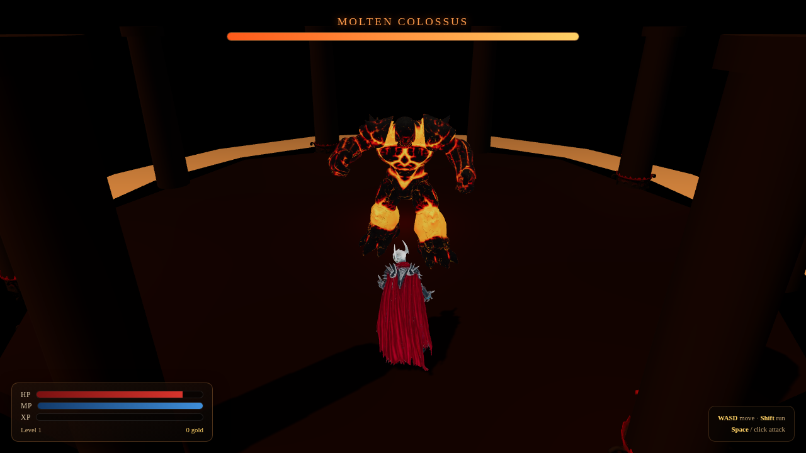
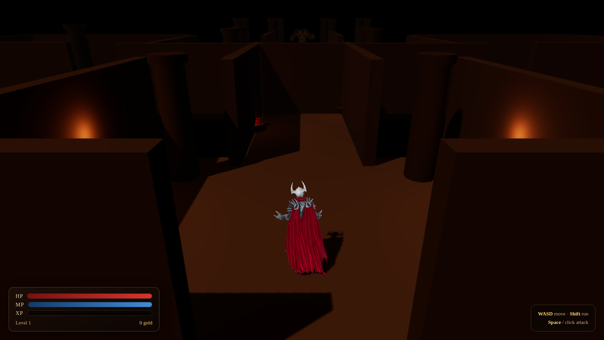
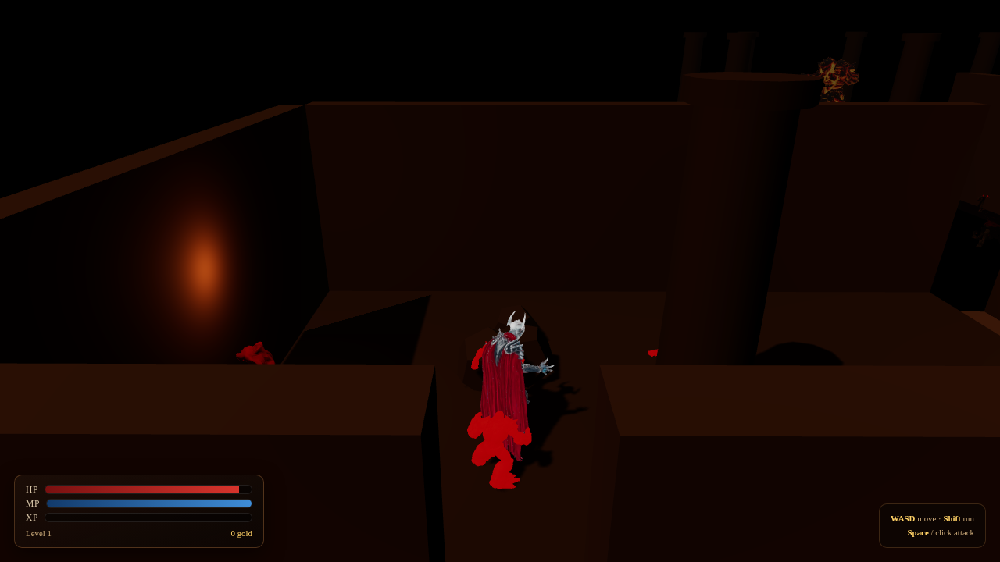
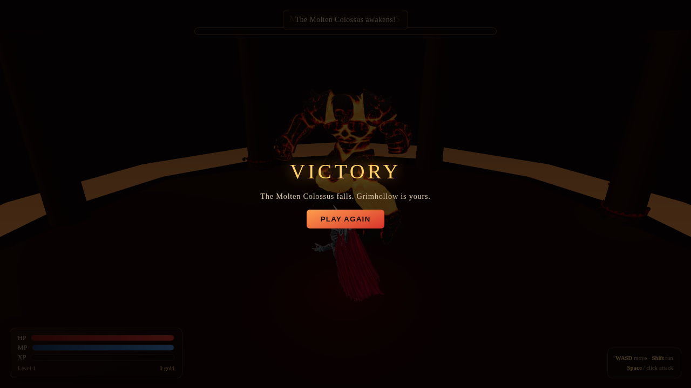

# Grimhollow: Molten Depths



**Grimhollow: Molten Depths** is a browser-playable, WoW-inspired ARPG dungeon crawler built with
**Three.js**, **TypeScript**, and **Vite**. A Death Knight descends through a gothic stone dungeon,
cuts down molten stone spawnlings, and faces the **Molten Colossus** — a giant lava-golem boss — in
a raised octagonal arena.

Both hero characters are original 3D assets generated, rigged, and animated end-to-end with
**Meshy.AI** — no static/pre-baked models.

> Originality note: this is a copyright-safe, genre-inspired original setting. It does not use
> Blizzard, World of Warcraft, or Diablo names, assets, lore, textures, or extracted game data.

## Live production demo

**Production URL:** _(added after deployment — see below)_

**GitHub repository:** https://github.com/carlomigueldy/grimhollow-molten-depths

## Screenshots

| Entrance | Combat |
|---|---|
|  |  |

| Boss encounter | Victory |
|---|---|
|  |  |

## Features

- **Rigged, animated Meshy.AI hero characters** — a Death Knight player and a Molten Colossus boss,
  each generated with Meshy's text-to-3D + refine pipeline, auto-rigged, and animated with custom
  idle/attack clips from Meshy's animation library (free walking/running included with rigging).
- **Original gothic dungeon** — entrance hall, twin side chambers (a spawnling den and a treasure
  room), a brazier-lit corridor, and a raised octagonal boss arena with a glowing lava moat, all
  built from procedural Three.js geometry with warm torchlight, fog, bloom, and ACES tone mapping.
- **Full combat loop** — melee arc attacks, an aggro-based trash mob (Molten Spawnling, a
  scaled/tinted reuse of the boss rig), a boss encounter with a telegraphed AoE ground-stomp
  attack, XP/leveling, gold, and a death → respawn-with-penalty flow.
- **Animation state machine** — crossfaded Idle/Walking/Running locomotion with one-shot attack
  clips layered on top, driven by a shared `AnimationController`.
- **Debuggable deterministic QA API** — `window.__GRIMHOLLOW__` for headless/automated gameplay
  verification (see below).

## Controls

| Action | Input |
|---|---|
| Move | `WASD` / arrow keys |
| Run | Hold `Shift` |
| Attack | `Space` or left click |

## Meshy.AI asset pipeline

The brief called for picking existing free community models from two Meshy.AI gallery pages (a
`golem/giant/elemental` boss collection and the `tags/warcraft` model list). Both pages were
real and were browsed with a headless Chromium session — concrete picks were identified
(**Molten Colossus** by `jurafjvs` and **WOW Death Knight** by `Ghostface`, both CC0). However,
Meshy.AI does not expose an unauthenticated raw GLB/FBX download for community-uploaded models —
only a proprietary signed asset consumed by their own web viewer, which isn't a format the rigging
API accepts. The Meshy MCP tools **do** fully support generating original models in-workspace and
rigging/animating them, which is a documented, credit-metered, first-class path — so both hero
assets were regenerated from scratch with prompts that reproduce the same names, tags, and visual
identity as the two community picks, then rigged and animated through that pipeline:

1. `meshy_text_to_3d` (Meshy 6, t-pose) → preview mesh
2. `meshy_text_to_3d_refine` (PBR textures) → textured mesh
3. `meshy_remesh` → under the 300k-face rigging limit
4. `meshy_rig` → skeleton + free Walking/Running clips
5. `meshy_animate` → custom `Idle` and attack clips (`Right_Hand_Sword_Slash` for the Death
   Knight, `Angry_Ground_Stomp` for the Colossus)

Two additional props (a treasure chest and an iron brazier torch) were generated the same way as
free, CC0-equivalent Meshy.AI game assets for dungeon dressing.

Total Meshy credit spend for this project: **122 credits** out of a 221-credit balance.

## Tech stack

- [Three.js](https://threejs.org/) — WebGL rendering, GLTF loading, `AnimationMixer`, lighting,
  shadows, tone mapping
- TypeScript (strict)
- Vite
- pnpm
- Vercel (production hosting)

## Run locally

Requirements:

- Node.js 22+
- pnpm 11+

```bash
pnpm install
pnpm run dev
```

Then open <http://127.0.0.1:5173>.

## Build

```bash
pnpm run build
pnpm run preview
```

The production build is emitted to `dist/`.

## Vercel deployment

```json
{
  "framework": "vite",
  "installCommand": "pnpm install --frozen-lockfile",
  "buildCommand": "pnpm run build",
  "outputDirectory": "dist"
}
```

```bash
pnpm dlx vercel@latest link
pnpm dlx vercel@latest deploy --prod
```

## QA / debug API

For deterministic smoke tests and gameplay verification, the app exposes `window.__GRIMHOLLOW__`:

```js
__GRIMHOLLOW__.state();              // hp, mana, level, gold, position, bossHp, bossPhase, spawnlings, etc.
__GRIMHOLLOW__.hold('KeyW', true);   // hold/release a movement key like a real player
__GRIMHOLLOW__.cast('attack');       // queue a melee attack
__GRIMHOLLOW__.teleport(x, z);       // reposition the player for tests
__GRIMHOLLOW__.wakeBoss();           // force the Molten Colossus to aggro
__GRIMHOLLOW__.damageBoss(n);        // deal direct boss damage (test-only shortcut)
__GRIMHOLLOW__.errors;               // buffered runtime errors
```

Append `?smoke=1` to the URL to skip the intro toast during automated tests.

`scripts/verify_playthrough.mjs` drives a full headless playthrough (movement, spawnling combat,
boss aggro/combat, victory) via Playwright and screenshots each stage. `scripts/capture_screenshot.mjs`
grabs a single boot screenshot.

## Verification performed

- `pnpm run build` (`tsc && vite build`) completes with zero type errors.
- Headless Chromium playthrough: player movement, melee hits landing on both the Molten Spawnling
  (confirmed HP loss on hit) and the Molten Colossus boss (confirmed HP loss on hit), boss
  aggro/stomp state machine, and the victory overlay all verified end-to-end with no runtime
  console errors.
- All animation clips (`Idle`, `Walking`, `Running`, `Right_Hand_Sword_Slash`,
  `Angry_Ground_Stomp`) confirmed present and playing on both rigged characters.

## Known limitations / follow-ups

- Each Meshy animation export bundles the full mesh again (`_withSkin`), so the two hero
  characters currently ship ~137 MB of GLBs total (5 files each: base + walk + run + idle +
  attack, merged onto one skeleton at runtime). A follow-up pass could strip the duplicate mesh
  data from the per-clip exports to cut this down substantially.
- Desktop keyboard/mouse only — no touch controls.
- Single dungeon/single boss encounter — no persistence, inventory, or multiplayer.

## Project structure

```txt
.
├── docs/screenshots/
├── public/assets/models/       # Meshy.AI GLBs (player, boss, chest, torch + per-clip exports)
├── scripts/                    # headless verification / screenshot tooling
├── src/
│   ├── main.ts                 # boot + game loop
│   ├── core/                   # renderer/camera/lighting, input
│   ├── world/                  # procedural dungeon geometry + collision
│   ├── entities/                # player, boss, spawnling, animation controller, GLTF loader
│   ├── combat/                 # melee hit resolution
│   ├── ui/                     # DOM HUD
│   └── debug/                  # window.__GRIMHOLLOW__ QA API
├── index.html
├── package.json
├── pnpm-workspace.yaml
├── tsconfig.json
├── vercel.json
└── README.md
```

## License

No open-source license has been selected yet. The source is public for viewing; reuse rights are
not granted unless a license is added later.
